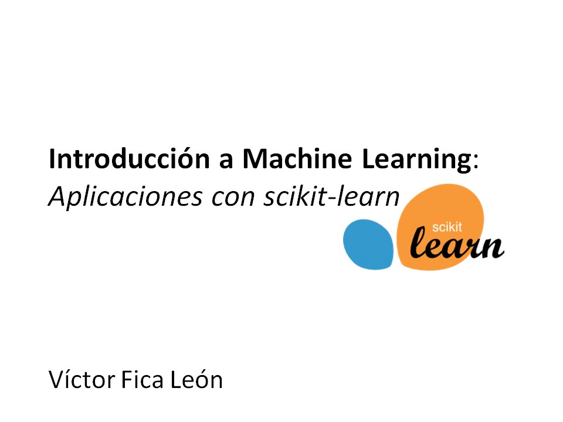

# Introducción a Machine Learning:
## Aplicaciones con scikit-learn

*Este tutorial entregara nociones basicas sobre aprendizaje automatico en python utilizando la libreria scikit-learn.*




Este tutorial abordara conceptos basicos de Aprendizaje Automatico en conjunto con la libreria scikit-learn. En general nos centraremos en algunos aspectos basicos del Aprendizaje Supervisado y algunas aplicaciones con scikit-learn. No es obligatorio para asistir al tutorial, pero recomiendo revisar el reporitorio Github en https://github.com/victorfica/ML-tutorial2017-vfica donde dispondre del material utilizado.   

---

Pueden ver el codigo del cuaderno jupyter [aqui](https://github.com/victorfica/ML-tutorial2017-vfica/blob/master/notebook/ML-intro-VF.ipynb)


# Obteniendo el material del tutorial

Si ya poseen una cuenta GitHub, probablemente la forma mas conveniente de obtener el material del tutorial es clonando este repositorio GitHub via     `git clone https://github.com/victorfica/ML-tutorial2017-vfica` y obtener las actualizaciones via `pull origin master`

Si no poseen una cuenta Github, pueden descargar el repositorio como un archivo .zip en la misma pagina web del repositorio. 


# Instalación y requerimientos

Mencionar que la instalación de las siguientes librerias son un requicito solo si desean ir siguiendo e interactuando con el codigo presentado en este tutorial, por lo tanto no es obligación para la asistencia.Este tutorial requiere los siguientes paquetes:

- Python version 2.6-2.7 or 3.3-3.4
- [Seaborn](https://seaborn.pydata.org/)
- [NumPy](http://www.numpy.org)
- [SciPy](http://www.scipy.org)
- [matplotlib](http://matplotlib.org)
- [pandas](http://pandas.pydata.org)
- [scikit-learn](http://scikit-learn.org/stable/)
- [IPython](http://ipython.readthedocs.org/en/stable/)
- [Jupyter Notebook](http://jupyter.org)

La manera mas sencilla de obtener esto es usando el gestor de paquetes y entornos virtuales [conda](https://store.continuum.io/).
Personalmente sugiero que descarguen [miniconda](http://conda.pydata.org/miniconda.html), la version que necesiten y con python 3.

Una vez instalado, el siguiente comando deberia instalar todos los paquetes requeridos en su entorno Python:
```
$ conda install numpy scipy matplotlib scikit-learn notebook seaborn
```
 
